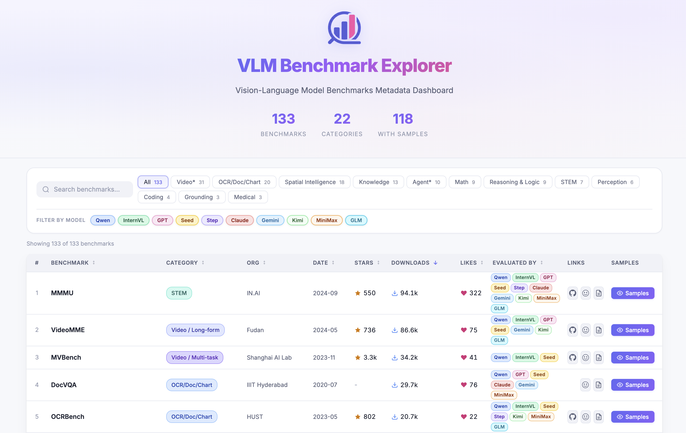

<p align="center">
  
</p>
<h1 align="center">Awesome MLLM Benchmarks</h1>
<p align="center">
  <em>An interactive explorer & paper list for MLLM benchmarks.</em>
</p>
<p align="center">
  <a href="https://awesome.re"></a>
  <a href="https://lchen1019.github.io/awesome-mllm-benchmarks/"></a>
  <a href="https://github.com/lchen1019/awesome-mllm-benchmarks"></a>
  <a href="https://github.com/lchen1019/awesome-mllm-benchmarks/pulls"></a>
  <a href="LICENSE"></a>
</p>
<p align="center">
  
  
  
</p>
<p align="center">
  <a href="https://lchen1019.github.io/awesome-mllm-benchmarks/"><strong>🌐 Explore the Interactive Dashboard »</strong></a>
</p>

---

We collect **130+ MLLM benchmarks** across **20+ categories** (OCR, Math, Video, Agent, Spatial Intelligence, etc.) with rich metadata including GitHub stars, HuggingFace downloads, paper abstracts, model evaluation coverage, and more. Everything is presented through a **modern interactive dashboard** — you can search, filter, sort, and browse actual benchmark samples directly in the browser.

<p align="center">
  <a href="https://lchen1019.github.io/awesome-mllm-benchmarks/">
    
  </a>
</p>

---

## Table of Contents

- [Getting Started](#-getting-started)
- [Benchmark List](#-benchmark-list)
  - [OCR / Doc / Chart](#ocrdocchart)
  - [Spatial Intelligence](#spatial-intelligence)
  - [Knowledge](#knowledge)
  - [Math](#math)
  - [Reasoning & Logic](#reasoning--logic)
  - [STEM](#stem)
  - [Perception](#perception)
  - [Grounding](#grounding)
  - [Coding](#coding)
  - [Medical](#medical)
  - [Video](#video)
  - [Agent](#agent)
- [Contributing](#-contributing)
- [Citation](#-citation)

---

## 🚀 Getting Started

Clone and serve locally:

```bash
git clone https://github.com/lchen1019/awesome-mllm-benchmarks.git
cd awesome-mllm-benchmarks
python serve.py 8080
```

Then open [http://localhost:8080](http://localhost:8080) in your browser.

> `serve.py` starts a simple HTTP server with no-cache headers. You can also use any other static file server.

**Project Structure**

```
awesome-mllm-benchmarks/
├── index.html                  # Main dashboard page
├── cases.html                  # Sample viewer page
├── data/                       # JSON metadata
│   ├── benchmarks.json         # Benchmark metadata (133 entries)
│   ├── model-matrix.json       # Model × Benchmark coverage data
│   └── cases-manifest.json     # Sample viewer config
├── samples/                    # Benchmark sample data (images, per-benchmark data.json)
├── assets/                     # Static assets (logo, favicon, screenshots)
├── serve.py                    # Dev server with no-cache headers
└── .github/workflows/pages.yml # GitHub Pages deployment
```


---

## 📚 Benchmark List

### OCR/Doc/Chart


| Benchmark              | Paper                                                                                                                                                                                                | Date    | Organization    |
| ---------------------- | ---------------------------------------------------------------------------------------------------------------------------------------------------------------------------------------------------- | ------- | --------------- |
| **TextVQA**            | [Paper](https://arxiv.org/abs/1904.08920) · [HF](https://huggingface.co/datasets/facebook/textvqa)                                                                                                   | 2019-04 | FAIR            |
| **DocVQA**             | [Paper](https://arxiv.org/abs/2007.00398) · [HF](https://huggingface.co/datasets/lmms-lab/DocVQA)                                                                                                    | 2020-07 | IIIT Hyderabad  |
| **ChartQA**            | [Paper](https://arxiv.org/abs/2203.10244) · [GitHub](https://github.com/vis-nlp/ChartQA) · [HF](https://huggingface.co/datasets/ahmed-masry/ChartQA)                                                 | 2022-03 | YorkU           |
| **OCRBench**           | [Paper](https://arxiv.org/abs/2305.07895) · [GitHub](https://github.com/Yuliang-Liu/MultimodalOCR) · [HF](https://huggingface.co/datasets/echo840/OCRBench)                                          | 2023-05 | HUST            |
| **DUDE**               | [Paper](https://arxiv.org/abs/2305.08455) · [GitHub](https://github.com/duchallenge-team/dude) · [HF](https://huggingface.co/datasets/jordyvl/DUDE_loader)                                           | 2023-05 | EPFL            |
| **ChartX**             | [Paper](https://arxiv.org/abs/2402.12185) · [HF](https://huggingface.co/datasets/InternScience/ChartX)                                                                                               | 2024-02 | Shanghai AI Lab |
| **CharXiv(RQ)**        | [Paper](https://arxiv.org/abs/2406.18521) · [GitHub](https://github.com/princeton-nlp/CharXiv) · [HF](https://huggingface.co/datasets/princeton-nlp/CharXiv)                                         | 2024-06 | Princeton       |
| **CharXiv(DQ)**        | [Paper](https://arxiv.org/abs/2406.18521) · [GitHub](https://github.com/princeton-nlp/CharXiv) · [HF](https://huggingface.co/datasets/princeton-nlp/CharXiv)                                         | 2024-06 | Princeton       |
| **MMLongBench-Doc**    | [Paper](https://arxiv.org/abs/2407.01523) · [GitHub](https://github.com/mayubo2333/MMLongBench-Doc) · [HF](https://huggingface.co/datasets/yubo2333/MMLongBench-Doc)                                 | 2024-07 | Tsinghua        |
| **CC-OCR**             | [Paper](https://arxiv.org/abs/2412.02210) · [GitHub](https://github.com/AlibabaResearch/AdvancedLiterateMachinery/tree/main/Benchmarks/CC-OCR) · [HF](https://huggingface.co/datasets/wulipc/CC-OCR) | 2024-12 | Alibaba         |
| **OmniDocBench**       | [Paper](https://arxiv.org/abs/2412.07626) · [GitHub](https://github.com/opendatalab/OmniDocBench) · [HF](https://huggingface.co/datasets/opendatalab/OmniDocBench)                                   | 2024-12 | Shanghai AI Lab |
| **OmniDocBench1.5**    | [Paper](https://arxiv.org/abs/2412.07626) · [GitHub](https://github.com/opendatalab/OmniDocBench) · [HF](https://huggingface.co/datasets/opendatalab/OmniDocBench)                                   | 2024-12 | Shanghai AI Lab |
| **LongDocURL**         | [Paper](https://arxiv.org/abs/2412.18424) · [GitHub](https://github.com/dengc2023/LongDocURL) · [HF](https://huggingface.co/datasets/dengchao/LongDocURL)                                            | 2024-12 | SJTU            |
| **OCRBench-v2**        | [Paper](https://arxiv.org/abs/2501.00321) · [GitHub](https://github.com/Yuliang-Liu/MultimodalOCR) · [HF](https://huggingface.co/datasets/echo840/OCRBench_v2)                                       | 2024-12 | HUST            |
| **ChartQAPro**         | [Paper](https://arxiv.org/abs/2504.05506) · [GitHub](https://github.com/vis-nlp/ChartQAPro) · [HF](https://huggingface.co/datasets/ahmed-masry/ChartQAPro)                                           | 2025-04 | YorkU           |
| **MMLongBench**        | [Paper](https://arxiv.org/abs/2505.10610) · [GitHub](https://github.com/EdinburghNLP/MMLongBench) · [HF](https://huggingface.co/datasets/VLM2Vec/MMLongBench)                                        | 2025-05 | Edinburgh       |
| **Real5-OmniDocBench** | [Paper](https://arxiv.org/abs/2603.04205) · [HF](https://huggingface.co/datasets/PaddlePaddle/Real5-OmniDocBench)                                                                                    | 2026-03 | Baidu           |
| **AI2D_TEST**          | [Paper](https://arxiv.org/abs/1603.07396) · [HF](https://huggingface.co/datasets/lmms-lab/ai2d)                                                                                                      | -       | AI2             |
| **InfoVQA**            | [Paper](https://arxiv.org/abs/2104.12756) · [HF](https://huggingface.co/datasets/Ahren09/InfoVQA)                                                                                                    | -       | IIIT Hyderabad  |
| **TableVQA**           | [HF](https://huggingface.co/datasets/terryoo/TableVQA-Bench)                                                                                                                                         | -       | KAIST           |


### Spatial Intelligence


| Benchmark           | Paper                                                                                                                                                                       | Date    | Organization    |
| ------------------- | --------------------------------------------------------------------------------------------------------------------------------------------------------------------------- | ------- | --------------- |
| **Nuscene**         | [Paper](https://arxiv.org/abs/1903.11027) · [GitHub](https://github.com/nutonomy/nuscenes-devkit)                                                                           | 2019-03 | nuTonomy        |
| **Hypersim**        | [Paper](https://arxiv.org/abs/2011.02523) · [GitHub](https://github.com/apple/ml-hypersim)                                                                                  | 2020-11 | Apple           |
| **ERQA**            | [Paper](https://arxiv.org/abs/2110.09992) · [GitHub](https://github.com/embodiedreasoning/ERQA) · [HF](https://huggingface.co/datasets/FlagEval/ERQA)                       | 2021-10 | BAAI            |
| **ARKitScenes**     | [Paper](https://arxiv.org/abs/2111.08897) · [GitHub](https://github.com/apple/ARKitScenes)                                                                                  | 2021-11 | Apple           |
| **ODInW13**         | [Paper](https://arxiv.org/abs/2206.05836) · [GitHub](https://github.com/microsoft/GLIP)                                                                                     | 2022-06 | Microsoft       |
| **LingoQA**         | [Paper](https://arxiv.org/abs/2312.14115) · [GitHub](https://github.com/wayveai/LingoQA)                                                                                    | 2023-12 | Wayve           |
| **BLINK**           | [Paper](https://arxiv.org/abs/2404.12390) · [GitHub](https://github.com/zzliang/BLINK) · [HF](https://huggingface.co/datasets/BLINK-Benchmark/BLINK)                        | 2024-04 | UPenn           |
| **DA-2K**           | [Paper](https://arxiv.org/abs/2406.09414) · [GitHub](https://github.com/DepthAnything/Depth-Anything-V2) · [HF](https://huggingface.co/datasets/depth-anything/DA-2K)       | 2024-06 | HKU             |
| **CV-Bench**        | [Paper](https://arxiv.org/abs/2406.16860) · [HF](https://huggingface.co/datasets/nyu-visionx/CV-Bench)                                                                      | 2024-06 | NYU             |
| **RoboSpatialHome** | [Paper](https://arxiv.org/abs/2411.16537) · [GitHub](https://github.com/NVlabs/RoboSpatial) · [HF](https://huggingface.co/datasets/chanhee-luke/RoboSpatial-Home)           | 2024-11 | OSU             |
| **VSI-Bench**       | [Paper](https://arxiv.org/abs/2412.14171) · [GitHub](https://github.com/vision-x-nyu/thinking-in-space) · [HF](https://huggingface.co/datasets/nyu-visionx/VSI-Bench)       | 2024-12 | NYU             |
| **All-Angles**      | [Paper](https://arxiv.org/abs/2504.15280) · [GitHub](https://github.com/Chenyu-Wang567/All-Angles-Bench) · [HF](https://huggingface.co/datasets/ch-chenyu/All-Angles-Bench) | 2025-04 | ZJU             |
| **MMSI-Bench**      | [Paper](https://arxiv.org/abs/2505.23764) · [GitHub](https://github.com/OpenRobotLab/MMSI-Bench) · [HF](https://huggingface.co/datasets/sihany/MMSI-Bench)                  | 2025-05 | Shanghai AI Lab |
| **RefSpatialBench** | [Paper](https://arxiv.org/abs/2506.04308) · [GitHub](https://github.com/Zhoues/RoboRefer) · [HF](https://huggingface.co/datasets/JingkunAn/RefSpatial)                      | 2025-06 | SJTU            |
| **TreeBench**       | [Paper](https://arxiv.org/abs/2507.07999) · [GitHub](https://github.com/Haochen-Wang409/TreeVGR) · [HF](https://huggingface.co/datasets/HaochenWang/TreeBench)              | 2025-07 | HKU             |
| **RefCOCO(avg)**    | [Paper](https://arxiv.org/abs/1608.00272) · [GitHub](https://github.com/lichengunc/refer) · [HF](https://huggingface.co/datasets/lmms-lab/RefCOCO)                          | -       | UNC             |
| **EmbSpatialBench** | [Paper](https://arxiv.org/abs/2406.05756) · [HF](https://huggingface.co/datasets/FlagEval/EmbSpatial-Bench)                                                                 | -       | BAAI            |
| **SUNRGBD**         | [Paper](https://rgbd.cs.princeton.edu/paper.pdf) · [GitHub](https://github.com/PrincetonVision/SUNRGBDtoolbox) · [HF](https://huggingface.co/datasets/Msun/sunrgbd)         | -       | Princeton       |


### Knowledge


| Benchmark           | Paper                                                                                                                                                                  | Date    | Organization    |
| ------------------- | ---------------------------------------------------------------------------------------------------------------------------------------------------------------------- | ------- | --------------- |
| **MMBench-V1.1-EN** | [Paper](https://arxiv.org/abs/2307.06281) · [GitHub](https://github.com/open-compass/MMBench) · [HF](https://huggingface.co/datasets/opencompass/MMBench)              | 2023-07 | Shanghai AI Lab |
| **MMBench-V1.1-CN** | [Paper](https://arxiv.org/abs/2307.06281) · [GitHub](https://github.com/open-compass/MMBench) · [HF](https://huggingface.co/datasets/opencompass/MMBench)              | 2023-07 | Shanghai AI Lab |
| **MMVet**           | [Paper](https://arxiv.org/abs/2308.02490) · [GitHub](https://github.com/yuweihao/MM-Vet) · [HF](https://huggingface.co/datasets/lmms-lab/MMVet)                        | 2023-08 | NUS             |
| **HallusionBench**  | [Paper](https://arxiv.org/abs/2310.14566) · [GitHub](https://github.com/tianyi-lab/HallusionBench) · [HF](https://huggingface.co/datasets/lmms-lab/HallusionBench)     | 2023-10 | UMD             |
| **MMStar**          | [Paper](https://arxiv.org/abs/2403.20330) · [GitHub](https://github.com/MMStar-Benchmark/MMStar) · [HF](https://huggingface.co/datasets/Lin-Chen/MMStar)               | 2024-03 | CUHK-SZ         |
| **MTVQA**           | [Paper](https://arxiv.org/abs/2405.11985) · [GitHub](https://github.com/bytedance/MTVQA) · [HF](https://huggingface.co/datasets/ByteDance/MTVQA)                       | 2024-05 | ByteDance       |
| **MUIRBench**       | [Paper](https://arxiv.org/abs/2406.09411) · [GitHub](https://github.com/muirbench/MuirBench) · [HF](https://huggingface.co/datasets/MUIRBENCH/MUIRBENCH)               | 2024-06 | UPenn           |
| **SimpleVQA**       | [Paper](https://arxiv.org/abs/2502.13059) · [GitHub](https://github.com/SimpleVQA/SimpleVQA) · [HF](https://huggingface.co/datasets/m-a-p/SimpleVQA)                   | 2025-02 | BUAA            |
| **ViVerBench**      | [Paper](https://arxiv.org/abs/2510.13804) · [GitHub](https://github.com/Cominclip/OmniVerifier) · [HF](https://huggingface.co/datasets/comin/ViVerBench)               | 2025-10 | Tsinghua        |
| **MME-CC**          | [Paper](https://arxiv.org/abs/2511.03146) · [GitHub](https://github.com/randomtutu/MME-CC) · [HF](https://huggingface.co/datasets/MaxwellWen/MME-CC)                   | 2025-11 | NTU             |
| **WorldVQA**        | [Paper](https://arxiv.org/abs/2602.02537) · [GitHub](https://github.com/MoonshotAI/WorldVQA) · [HF](https://huggingface.co/datasets/moonshotai/WorldVQA)               | 2026-01 | Moonshot AI     |
| **RealWorldQA**     | [HF](https://huggingface.co/datasets/xai-org/RealWorldQA)                                                                                                              | -       | xAI             |
| **VibeEval**        | [Paper](https://publications.reka.ai/reka-vibe-eval.pdf) · [GitHub](https://github.com/reka-ai/reka-vibe-eval) · [HF](https://huggingface.co/datasets/RekaAI/VibeEval) | -       | Reka AI         |


### Math


| Benchmark         | Paper                                                                                                                                                                           | Date    | Organization |
| ----------------- | ------------------------------------------------------------------------------------------------------------------------------------------------------------------------------- | ------- | ------------ |
| **MathVista**     | [Paper](https://arxiv.org/abs/2310.02255) · [GitHub](https://github.com/lupantech/MathVista) · [HF](https://huggingface.co/datasets/AI4Math/MathVista)                          | 2023-10 | UCLA         |
| **OlympiadBench** | [Paper](https://arxiv.org/abs/2402.14008) · [GitHub](https://github.com/OpenBMB/OlympiadBench) · [HF](https://huggingface.co/datasets/Hothan/OlympiadBench)                     | 2024-02 | Tsinghua     |
| **MathVision**    | [Paper](https://arxiv.org/abs/2402.14804) · [GitHub](https://github.com/mathvision-cuhk/MathVision) · [HF](https://huggingface.co/datasets/MathLLMs/MathVision)                 | 2024-02 | CUHK         |
| **DynaMath**      | [Paper](https://arxiv.org/abs/2411.00836) · [GitHub](https://github.com/DynaMath/DynaMath) · [HF](https://huggingface.co/datasets/DynaMath/DynaMath_Sample)                     | 2024-11 | Yale         |
| **MathVerse**     | [Paper](https://arxiv.org/abs/2403.14624) · [GitHub](https://github.com/ZrrSkyworker/MathVerse) · [HF](https://huggingface.co/datasets/AI4Math/MathVerse)                       | 2024-03 | CUHK         |
| **We-Math**       | [Paper](https://arxiv.org/abs/2407.01284) · [GitHub](https://github.com/We-Math/We-Math) · [HF](https://huggingface.co/datasets/We-Math/We-Math)                                | 2024-07 | BAAI         |
| **MATH-V**        | [Paper](https://arxiv.org/abs/2407.08739) · [GitHub](https://github.com/mathllm/MATH-V) · [HF](https://huggingface.co/datasets/mathllm/MATH-V)                                  | 2024-07 | SJTU         |
| **CountBench**    | [Paper](https://arxiv.org/abs/2301.12307) · [HF](https://huggingface.co/datasets/nielsr/countbench)                                                                             | 2023-01 | Google       |
| **MathCheck-GEO** | [Paper](https://arxiv.org/abs/2407.15684) · [GitHub](https://github.com/baochi0212/MathCheck-GEO) · [HF](https://huggingface.co/datasets/EasonChen11112/MathCheck-GEO_Datasets) | 2024-07 | NTU          |


### Reasoning & Logic


| Benchmark         | Paper                                                                                                                                                            | Date    | Organization |
| ----------------- | ---------------------------------------------------------------------------------------------------------------------------------------------------------------- | ------- | ------------ |
| **ArcAGI1-Image** | [Paper](https://arxiv.org/abs/1911.01547) · [GitHub](https://github.com/fchollet/ARC-AGI) · [HF](https://huggingface.co/datasets/barc0/ARC-AGI-1-image)          | 2019-11 | -            |
| **ArcAG2-Image**  | [Paper](https://arxiv.org/abs/2412.04604) · [GitHub](https://github.com/fchollet/ARC-AGI) · [HF](https://huggingface.co/datasets/barc0/ARC-AGI-2-image)          | 2024-12 | Zapier       |
| **MMMU**          | [Paper](https://arxiv.org/abs/2409.02813) · [GitHub](https://github.com/MMMU-Benchmark/MMMU) · [HF](https://huggingface.co/datasets/MMMU/MMMU)                   | 2024-09 | IN.AI        |
| **LogicVista**    | [Paper](https://arxiv.org/abs/2407.04973) · [GitHub](https://github.com/Yijia-Xiao/LogicVista) · [HF](https://huggingface.co/datasets/Yijia-Xiao/LogicVista)     | 2024-07 | UCLA         |
| **EMMA**          | [Paper](https://arxiv.org/abs/2501.05444) · [GitHub](https://github.com/hychaochao/EMMA) · [HF](https://huggingface.co/datasets/hychaochao/EMMA)                 | 2025-01 | HUST         |
| **BabyVision**    | [Paper](https://arxiv.org/abs/2504.13400) · [HF](https://huggingface.co/datasets/BabyVisionProject/BabyVision)                                                   | 2025-04 | Tsinghua     |
| **VBench**        | [Paper](https://arxiv.org/abs/2505.23410) · [GitHub](https://github.com/SUN-Jianzhi/VBench) · [HF](https://huggingface.co/datasets/Turing-AGI/VBench)            | 2025-05 | ZJU          |
| **MME-Reasoning** | [Paper](https://arxiv.org/abs/2503.07487) · [GitHub](https://github.com/MileBench/MME-Reasoning) · [HF](https://huggingface.co/datasets/MileBench/MME-Reasoning) | 2025-03 | NJU          |
| **VisualPuzzles** | [Paper](https://arxiv.org/abs/2504.10342) · [GitHub](https://github.com/Lxoiux/VisualPuzzles) · [HF](https://huggingface.co/datasets/jmhb/VisualPuzzles)         | 2025-04 | Stanford     |


### STEM


| Benchmark        | Paper                                                                                                                                                         | Date    | Organization |
| ---------------- | ------------------------------------------------------------------------------------------------------------------------------------------------------------- | ------- | ------------ |
| **ScienceQA**    | [Paper](https://arxiv.org/abs/2209.09513) · [GitHub](https://github.com/lupantech/ScienceQA) · [HF](https://huggingface.co/datasets/derek-thomas/ScienceQA)   | 2022-09 | UCLA         |
| **MMMU-Pro**     | [Paper](https://arxiv.org/abs/2409.02813) · [GitHub](https://github.com/MMMU-Benchmark/MMMU) · [HF](https://huggingface.co/datasets/MMMU/MMMU_Pro)            | 2024-09 | IN.AI        |
| **SciFIG**       | [Paper](https://arxiv.org/abs/2405.18740) · [GitHub](https://github.com/SciFig/SciFig) · [HF](https://huggingface.co/datasets/SciFig/SciFig-Bench)            | 2024-05 | Adobe        |
| **HistoryBench** | [Paper](https://arxiv.org/abs/2502.07135) · [HF](https://huggingface.co/datasets/UniModal4Reasoning/HistoryBench)                                             | 2025-02 | CAS          |
| **MEGA-Bench**   | [Paper](https://arxiv.org/abs/2410.10563) · [GitHub](https://github.com/TIGER-AI-Lab/MEGA-Bench) · [HF](https://huggingface.co/datasets/TIGER-Lab/MEGA-Bench) | 2024-10 | TIGER-Lab    |
| **NPHardEval4V** | [Paper](https://arxiv.org/abs/2403.01777) · [GitHub](https://github.com/lizhouf/NPHardEval4V) · [HF](https://huggingface.co/datasets/lizhouf/NPHardEval4V)    | 2024-03 | UMich        |
| **GPQA-Diamond** | [Paper](https://arxiv.org/abs/2311.12022) · [HF](https://huggingface.co/datasets/Idavidrein/gpqa)                                                             | 2023-11 | NYU          |


### Perception


| Benchmark         | Paper                                                                                                                                                                          | Date    | Organization |
| ----------------- | ------------------------------------------------------------------------------------------------------------------------------------------------------------------------------ | ------- | ------------ |
| **RealWorldQA**   | [HF](https://huggingface.co/datasets/xai-org/RealWorldQA)                                                                                                                      | -       | xAI          |
| **MME**           | [Paper](https://arxiv.org/abs/2306.13394) · [GitHub](https://github.com/BradyFU/Awesome-Multimodal-Large-Language-Models) · [HF](https://huggingface.co/datasets/lmms-lab/MME) | 2023-06 | NJU          |
| **SEEDBench**     | [Paper](https://arxiv.org/abs/2307.16125) · [GitHub](https://github.com/AILab-CVC/SEED-Bench) · [HF](https://huggingface.co/datasets/lmms-lab/SEED-Bench)                      | 2023-07 | Tencent      |
| **CRPE**          | [Paper](https://arxiv.org/abs/2403.11289) · [GitHub](https://github.com/THUDM/CogVLM2) · [HF](https://huggingface.co/datasets/THUDM/CRPE)                                      | 2024-03 | Tsinghua     |
| **MME-RealWorld** | [Paper](https://arxiv.org/abs/2408.13257) · [GitHub](https://github.com/mme-realworld/mme-realworld) · [HF](https://huggingface.co/datasets/yifanzhang114/MME-RealWorld)       | 2024-08 | NJU          |
| **WildVision**    | [Paper](https://arxiv.org/abs/2406.11069) · [GitHub](https://github.com/WildVision/WildVision-Bench) · [HF](https://huggingface.co/datasets/WildVision/wildvision-bench)       | 2024-06 | AI2          |


### Grounding


| Benchmark        | Paper                                                                                                                                                                              | Date    | Organization    |
| ---------------- | ---------------------------------------------------------------------------------------------------------------------------------------------------------------------------------- | ------- | --------------- |
| **RefCOCO(avg)** | [Paper](https://arxiv.org/abs/1608.00272) · [GitHub](https://github.com/lichengunc/refer) · [HF](https://huggingface.co/datasets/lmms-lab/RefCOCO)                                 | -       | UNC             |
| **ScreenSpot**   | [Paper](https://arxiv.org/abs/2505.12370) · [GitHub](https://github.com/likaixin2000/ScreenSpot-Pro-GUI-Grounding) · [HF](https://huggingface.co/datasets/likaixin/ScreenSpot-Pro) | 2025-05 | Shanghai AI Lab |
| **ODInW13**      | [Paper](https://arxiv.org/abs/2206.05836) · [GitHub](https://github.com/microsoft/GLIP)                                                                                            | 2022-06 | Microsoft       |


### Coding


| Benchmark       | Paper                                                                                                                                                        | Date    | Organization |
| --------------- | ------------------------------------------------------------------------------------------------------------------------------------------------------------ | ------- | ------------ |
| **Design2Code** | [Paper](https://arxiv.org/abs/2403.03163) · [GitHub](https://github.com/NoviScl/Design2Code) · [HF](https://huggingface.co/datasets/SALT-NLP/Design2Code)    | 2024-03 | Stanford     |
| **ChartMimic**  | [Paper](https://arxiv.org/abs/2406.09961) · [GitHub](https://github.com/ChartMimic/ChartMimic) · [HF](https://huggingface.co/datasets/ChartMimic/ChartMimic) | 2024-06 | Tsinghua     |
| **UniSVG**      | [Paper](https://arxiv.org/abs/2511.21631) · [HF](https://huggingface.co/datasets/lili24/UniSVG)                                                              | 2025-11 | SJTU         |
| **FronTalk**    | [Paper](https://arxiv.org/abs/2601.04203) · [HF](https://huggingface.co/datasets/xqwu/FronTalk)                                                              | 2025-12 | UCLA         |


### Medical


| Benchmark         | Paper                                                                                                                                                          | Date    | Organization |
| ----------------- | -------------------------------------------------------------------------------------------------------------------------------------------------------------- | ------- | ------------ |
| **SLAKE**         | [Paper](https://arxiv.org/abs/2102.09542) · [HF](https://huggingface.co/datasets/BoKelvin/SLAKE)                                                               | 2021-02 | OSU          |
| **PMC-VQA**       | [Paper](https://arxiv.org/abs/2305.10415) · [GitHub](https://github.com/xiaoman-zhang/PMC-VQA) · [HF](https://huggingface.co/datasets/xmcmic/PMC-VQA)          | 2023-05 | ZJU          |
| **MedXpertQA-MM** | [Paper](https://arxiv.org/abs/2501.18362) · [GitHub](https://github.com/TsinghuaC3I/MedXpertQA) · [HF](https://huggingface.co/datasets/TsinghuaC3I/MedXpertQA) | 2025-01 | Tsinghua     |


### Video

**Video / Knowledge**


| Benchmark         | Paper                                                                                                                                                                    | Date    | Organization |
| ----------------- | ------------------------------------------------------------------------------------------------------------------------------------------------------------------------ | ------- | ------------ |
| **MMVU**          | [Paper](https://arxiv.org/abs/2501.12380) · [GitHub](https://github.com/yale-nlp/MMVU) · [HF](https://huggingface.co/datasets/yale-nlp/MMVU)                             | 2025-01 | Yale         |
| **VideoMMMU**     | [Paper](https://arxiv.org/abs/2501.13826) · [GitHub](https://github.com/EvolvingLMMs-Lab/VideoMMMU) · [HF](https://huggingface.co/datasets/lmms-lab/VideoMMMU)           | 2025-01 | NTU          |
| **VCRBench**      | [Paper](https://arxiv.org/abs/2505.08455) · [GitHub](https://github.com/pritamqu/VCRBench) · [HF](https://huggingface.co/datasets/VLM-Reasoning/VCR-Bench)               | 2025-05 | McGill       |
| **VideoSimpleQA** | [Paper](https://arxiv.org/abs/2503.18923) · [GitHub](https://github.com/VideoSimpleQA/VideoSimpleQA) · [HF](https://huggingface.co/datasets/VideoSimpleQA/VideoSimpleQA) | -       | ByteDance    |


**Video / Reasoning**


| Benchmark            | Paper                                                                                                                                                                | Date    | Organization |
| -------------------- | -------------------------------------------------------------------------------------------------------------------------------------------------------------------- | ------- | ------------ |
| **Minera**           | [Paper](https://arxiv.org/abs/2505.00681) · [GitHub](https://github.com/google-deepmind/neptune)                                                                     | 2025-05 | DeepMind     |
| **VideoHolmes**      | [Paper](https://arxiv.org/abs/2505.21374) · [GitHub](https://github.com/TencentARC/Video-Holmes) · [HF](https://huggingface.co/datasets/pqowieuryrty/Video-Holmes)   | 2025-05 | Tencent ARC  |
| **VideoReasonBench** | [Paper](https://arxiv.org/abs/2505.23359) · [GitHub](https://github.com/llyx97/video_reason_bench) · [HF](https://huggingface.co/datasets/lyx97/reasoning_videos)    | 2025-05 | NTU          |
| **Mores-500**        | [Paper](https://arxiv.org/abs/2506.05523) · [GitHub](https://github.com/morse-benchmark/morse-500) · [HF](https://huggingface.co/datasets/video-reasoning/morse-500) | 2025-06 | HKUST        |


**Video / Motion**


| Benchmark           | Paper                                                                                                                                                                     | Date    | Organization |
| ------------------- | ------------------------------------------------------------------------------------------------------------------------------------------------------------------------- | ------- | ------------ |
| **Countix**         | [Paper](https://arxiv.org/abs/2006.15418)                                                                                                                                 | 2020-06 | Google       |
| **ContPhy**         | [Paper](https://arxiv.org/abs/2402.06119) · [GitHub](https://github.com/Cakeyan/ContPhy_Public) · [HF](https://huggingface.co/datasets/zzcnewly/ContPhy_Dataset)          | 2024-02 | Westlake     |
| **TempCompass**     | [Paper](https://arxiv.org/abs/2403.00476) · [GitHub](https://github.com/llyx97/TempCompass) · [HF](https://huggingface.co/datasets/lmms-lab/TempCompass)                  | 2024-03 | NTU          |
| **TVBench**         | [Paper](https://arxiv.org/abs/2410.07752) · [GitHub](https://github.com/daniel-cores/tvbench) · [HF](https://huggingface.co/datasets/FunAILab/TVBench)                    | 2024-10 | USC          |
| **TOMATO**          | [Paper](https://arxiv.org/abs/2410.23266) · [HF](https://huggingface.co/datasets/yale-nlp/TOMATO)                                                                         | 2024-10 | Yale         |
| **MotionBench**     | [Paper](https://arxiv.org/abs/2501.02955) · [GitHub](https://github.com/THUDM/MotionBench) · [HF](https://huggingface.co/datasets/THUDM/MotionBench)                      | 2025-01 | Tsinghua     |
| **EgoTempo**        | [Paper](https://arxiv.org/abs/2503.13646) · [GitHub](https://github.com/google-research-datasets/egotempo) · [HF](https://huggingface.co/datasets/lmms-lab-eval/egotempo) | 2025-03 | Google       |
| **VideoThinkBench** | [Paper](https://arxiv.org/abs/2511.04570) · [GitHub](https://github.com/tongjingqi/Thinking-with-Video) · [HF](https://huggingface.co/datasets/fnlp/VideoThinkBench)      | 2025-11 | Fudan        |


**Video / Long-form**


| Benchmark          | Paper                                                                                                                                                                        | Date    | Organization |
| ------------------ | ---------------------------------------------------------------------------------------------------------------------------------------------------------------------------- | ------- | ------------ |
| **VideoMME**       | [Paper](https://arxiv.org/abs/2405.21075) · [GitHub](https://github.com/MME-Benchmarks/Video-MME) · [HF](https://huggingface.co/datasets/lmms-lab/Video-MME)                 | 2024-05 | Fudan        |
| **MLVU**           | [Paper](https://arxiv.org/abs/2406.04264) · [GitHub](https://github.com/JUNJIE99/MLVU) · [HF](https://huggingface.co/datasets/MLVU/MVLU)                                     | 2024-06 | BAAI         |
| **LVBench**        | [Paper](https://arxiv.org/abs/2406.08035) · [GitHub](https://github.com/THUDM/LVBench) · [HF](https://huggingface.co/datasets/THUDM/LVBench)                                 | 2024-06 | Tsinghua     |
| **LongVideoBench** | [Paper](https://arxiv.org/abs/2407.15754) · [GitHub](https://github.com/longvideobench/LongVideoBench) · [HF](https://huggingface.co/datasets/longvideobench/LongVideoBench) | 2024-07 | Tsinghua     |
| **VideoEval-Pro**  | [Paper](https://arxiv.org/abs/2505.14640) · [GitHub](https://github.com/TIGER-AI-Lab/VideoEval-Pro) · [HF](https://huggingface.co/datasets/TIGER-Lab/VideoEval-Pro)          | 2025-05 | TIGER-Lab    |
| **CGBench**        | [Paper](https://arxiv.org/abs/2510.11985) · [GitHub](https://github.com/CG-Bench/CG-Bench) · [HF](https://huggingface.co/datasets/CG-Bench/CG-Bench)                         | 2025-10 | NJU          |


**Video / Streaming**


| Benchmark          | Paper                                                                                                                                                            | Date    | Organization |
| ------------------ | ---------------------------------------------------------------------------------------------------------------------------------------------------------------- | ------- | ------------ |
| **StreamingBench** | [Paper](https://arxiv.org/abs/2411.03628) · [GitHub](https://github.com/THUNLP-MT/StreamingBench) · [HF](https://huggingface.co/datasets/mjuicem/StreamingBench) | 2024-11 | Tsinghua     |
| **OVBench**        | [Paper](https://arxiv.org/abs/2501.00584) · [GitHub](https://github.com/MCG-NJU/VideoChat-Online) · [HF](https://huggingface.co/datasets/MCG-NJU/OVBench)        | 2024-12 | NJU          |
| **OVOBench**       | [Paper](https://arxiv.org/abs/2501.05510) · [GitHub](https://github.com/JoeLeelyf/OVO-Bench) · [HF](https://huggingface.co/datasets/JoeLeelyf/OVO-Bench)         | 2025-01 | PKU          |
| **ViSpeak**        | [Paper](https://arxiv.org/abs/2503.12769) · [GitHub](https://github.com/HumanMLLM/ViSpeak) · [HF](https://huggingface.co/datasets/fushh7/ViSpeak-Bench)          | 2025-03 | Alibaba      |
| **OminiMMI**       | [Paper](https://arxiv.org/abs/2503.22952) · [GitHub](https://github.com/OmniMMI/OmniMMI) · [HF](https://huggingface.co/datasets/bigai-nlco/OmniMMI)              | 2025-03 | BIGAI        |
| **ODVBench**       | [Paper](https://arxiv.org/abs/2509.24871) · [GitHub](https://github.com/MCG-NJU/StreamForest) · [HF](https://huggingface.co/datasets/MCG-NJU/ODV-Bench)          | 2025-09 | NJU          |
| **LiveSports-3k**  | [Paper](https://arxiv.org/abs/2504.16030) · [GitHub](https://github.com/showlab/livecc) · [HF](https://huggingface.co/datasets/stdKonjac/LiveSports-3K)          | -       | NUS          |


**Video / Multi-task & Multiple**


| Benchmark    | Paper                                                                                                                                                       | Date    | Organization    |
| ------------ | ----------------------------------------------------------------------------------------------------------------------------------------------------------- | ------- | --------------- |
| **MVBench**  | [Paper](https://arxiv.org/abs/2311.17005) · [GitHub](https://github.com/OpenGVLab/Ask-Anything) · [HF](https://huggingface.co/datasets/OpenGVLab/MVBench)   | 2023-11 | Shanghai AI Lab |
| **CrossVid** | [Paper](https://arxiv.org/abs/2511.12263) · [GitHub](https://github.com/chuntianli666/CrossVid) · [HF](https://huggingface.co/datasets/Chuntianli/CrossVid) | 2025-11 | UCSD            |


### Agent

**Agent / General**


| Benchmark             | Paper                                                                                                                                                                              | Date    | Organization    |
| --------------------- | ---------------------------------------------------------------------------------------------------------------------------------------------------------------------------------- | ------- | --------------- |
| **Minedojo Verified** | [Paper](https://arxiv.org/abs/2206.08853) · [GitHub](https://github.com/MineDojo/MineDojo)                                                                                         | 2022-06 | NVIDIA          |
| **ScreenSpot Pro**    | [Paper](https://arxiv.org/abs/2505.12370) · [GitHub](https://github.com/likaixin2000/ScreenSpot-Pro-GUI-Grounding) · [HF](https://huggingface.co/datasets/likaixin/ScreenSpot-Pro) | 2025-05 | Shanghai AI Lab |


**Agent / Computer**


| Benchmark            | Paper                                                                                                                                             | Date    | Organization |
| -------------------- | ------------------------------------------------------------------------------------------------------------------------------------------------- | ------- | ------------ |
| **OSWorld-Verified** | [Paper](https://arxiv.org/abs/2404.07972) · [GitHub](https://github.com/xlang-ai/OSWorld) · [HF](https://huggingface.co/datasets/xlangai/osworld) | 2024-04 | HKU          |
| **WindowsAA**        | [Paper](https://arxiv.org/abs/2409.08264) · [GitHub](https://github.com/microsoft/WindowsAgentArena)                                              | 2024-09 | Microsoft    |


**Agent / Browser**


| Benchmark           | Paper                                                                                                                                                          | Date    | Organization |
| ------------------- | -------------------------------------------------------------------------------------------------------------------------------------------------------------- | ------- | ------------ |
| **Online-Mind2web** | [Paper](https://arxiv.org/abs/2504.01382) · [GitHub](https://github.com/OSU-NLP-Group/Online-Mind2Web) · [HF](https://huggingface.co/datasets/osunlp/Mind2Web) | 2025-04 | OSU          |
| **PA-Bench**        | [Paper](https://vibrantlabs.com/blog/pa-bench)                                                                                                                 | -       | VibrantLabs  |


**Agent / Mobile**


| Benchmark        | Paper                                                                                                  | Date    | Organization |
| ---------------- | ------------------------------------------------------------------------------------------------------ | ------- | ------------ |
| **AndroidWorld** | [Paper](https://arxiv.org/abs/2405.14573) · [GitHub](https://github.com/google-research/android_world) | 2024-05 | Google       |


**Agent / Visual Search**


| Benchmark         | Paper                                                                                                                                                                 | Date    | Organization |
| ----------------- | --------------------------------------------------------------------------------------------------------------------------------------------------------------------- | ------- | ------------ |
| **BrowseComp-VL** | [Paper](https://arxiv.org/abs/2508.05748) · [GitHub](https://github.com/Alibaba-NLP/DeepResearch)                                                                     | 2025-08 | Alibaba      |
| **MM-BrowseComp** | [Paper](https://arxiv.org/abs/2508.13186) · [GitHub](https://github.com/MMBrowseComp/MM-BrowseComp) · [HF](https://huggingface.co/datasets/mmbrowsecomp/MMBrowseComp) | 2025-08 | ByteDance    |
| **HLE-VL**        | [Paper](https://arxiv.org/abs/2501.14249) · [HF](https://huggingface.co/datasets/DjangoJungle/hle-vl)                                                                 | -       | Scale AI     |


---

## 🤝 Contributing

Contributions are welcome — whether it's adding new benchmarks & data, improving visualizations, or fixing errors. Feel free to open a PR!

---

## 📝 Citation

If you find this project useful for your research, please consider citing:

```bibtex
@misc{awesome-mllm-benchmarks,
  title        = {Awesome MLLM Benchmarks: An Interactive Explorer for MLLM Benchmarks},
  author       = {Chen, Lin},
  year         = {2026},
  howpublished = {\url{https://github.com/lchen1019/awesome-mllm-benchmarks}},
  note         = {Accessed: 2026}
}
```


